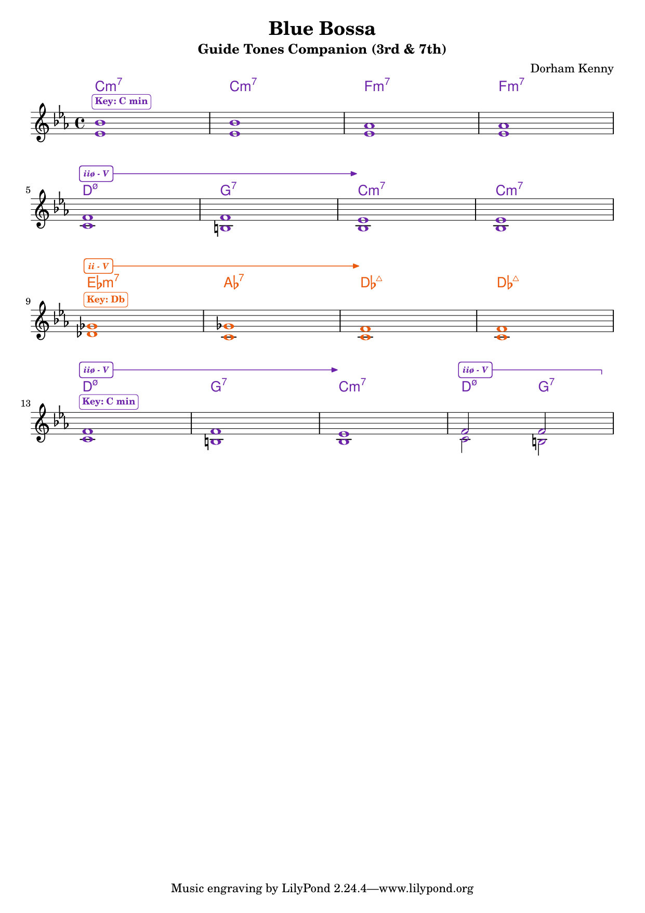
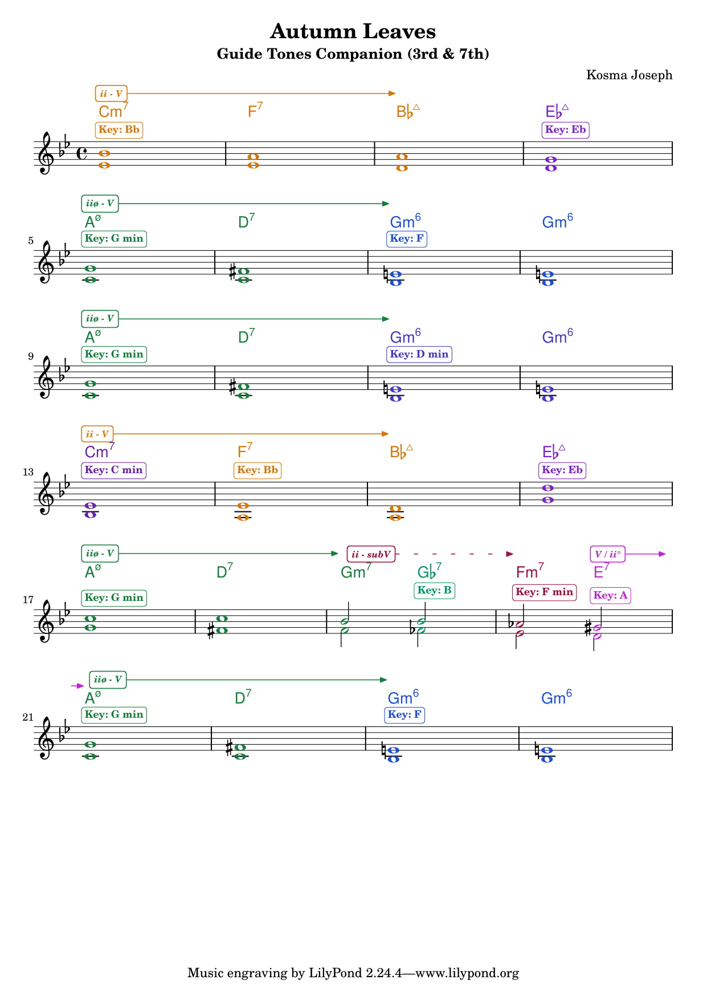

# jazz-tools

Command-line utility and jazz music theory engine to analyze jazz standards, track tonal centers and harmonic cadences, import lead sheets from **MusicXML** and **iReal Pro**, and generate voice-led **Guide Tone (3rd & 7th) Companion Sheets** for combo rehearsal, soloing practice, and study.

---

## Features

- **Tonal Center & Harmonic Journey Analysis**:
  - Automatically identifies local tonal centers and key modulations throughout each tune.
  - Generates a visual, colorized **Harmonic Journey** summarizing key changes across measures.
- **Berklee-Style Harmonic Device Annotations**:
  - **$\text{ii-V-I}$ / $\text{ii}^\varnothing\text{-V-i}$ Brackets & Arrows**: Solid overhead brackets spanning $\text{ii-V}$ pairs with an arrow pointing to the target resolution chord.
  - **Cadential Turnaround Hooks (`┐`)**: Terminal downward hooks for unresolved $\text{ii-V}$ cadences at phrase ends.
  - **Tritone Substitutions**: Dashed brackets and arrows for $\text{ii-subV}$ and isolated $\text{subV}$.
  - **Secondary Dominants**: Brackets and resolution arrows labeled relative to the home tonic ($\text{V/vi}$, $\text{V/ii}$, $\text{V/V}$, $\text{V/IV}$, etc.).
  - **Multi-Measure Dominant Spanning**: Brackets expand across consecutive identical chords.
- **Voice-Led Guide Tone Companion Generator**:
  - Voices the **3rd and 7th** of every chord on the treble staff for the exact duration of each chord hold.
  - Connects two independent polyphonic voices (Voice 1 upper stems up, Voice 2 lower stems down) via minimal motion for smooth, stepwise voice leading.
- **Smart Page Budgeting & Single-Page Guarantee**:
  - Automatically breaks lines to natural musical phrases (4 bars/system for tunes $\le 24$ bars, 8 bars/system for 32-bar standards).
  - Compact vertical spacing ensures charts fit cleanly on **exactly one page**.
- **Multi-Format Ingestion**:
  - **MusicXML**: Parses lead sheets from iReal Pro, MuseScore, Sibelius, or Finale.
  - **iReal Pro**: Directly imports from `irealb://` links, exported `.html` playlists, or forum chord charts.

---

## Examples & Walkthrough

### 1. Terminal Harmonic Analysis (`jazz-tools analyze`)

Analyze any MusicXML file or iReal Pro URL/HTML export to inspect chord holds, voice-led guide tones, and tonal journey:

```bash
jazz-tools analyze Blue_Bossa.musicxml
```

**Output snippet:**
```text
=============================================================================================
Tune: Blue Bossa by Dorham Kenny
Key: C minor | Time Signature: 4/4 | Measures: 16
---------------------------------------------------------------------------------------------
Measure | Beat | Chord         | Hold (beats) | Voice 1 (3/7) | Voice 2 (3/7) | Tonal Center
--------+------+---------------+--------------+---------------+---------------+-------------
     1  |  1.0 | Cm7           |          4.0 | Bb4           | Eb4           | C min      
     2  |  1.0 | Cm7           |          4.0 | Bb4           | Eb4           | C min      
     3  |  1.0 | Fm7           |          4.0 | Ab4           | Eb4           | C min      
     4  |  1.0 | Fm7           |          4.0 | Ab4           | Eb4           | C min      
     5  |  1.0 | Dø            |          4.0 | F4            | C4            | C min      
     6  |  1.0 | G7b9          |          4.0 | F4            | B3            | C min      
     7  |  1.0 | Cm7           |          4.0 | Eb4           | Bb3           | C min      
     8  |  1.0 | Cm7           |          4.0 | Eb4           | Bb3           | C min      
     9  |  1.0 | Ebm7          |          4.0 | Gb4           | Db4           | Db         
    10  |  1.0 | Ab7           |          4.0 | Gb4           | C4            | Db         
    11  |  1.0 | Db^7          |          4.0 | F4            | C4            | Db         
    12  |  1.0 | Db^7          |          4.0 | F4            | C4            | Db         
    13  |  1.0 | Dø            |          4.0 | F4            | C4            | C min      
    14  |  1.0 | G7b9          |          4.0 | F4            | B3            | C min      
    15  |  1.0 | Cm7           |          4.0 | Eb4           | Bb3           | C min      
    16  |  1.0 | Dø            |          2.0 | F4            | C4            | C min      
    16  |  3.0 | G7b9          |          2.0 | F4            | B3            | C min      
---------------------------------------------------------------------------------------------
Harmonic Journey:
  [ C min ] (bars 1-8) ➔ [ Db ] (bars 9-12) ➔ [ C min ] (bars 13-16)
=============================================================================================
```

---

### 2. Print-Ready Companion Sheets (`jazz-tools companion`)

Generate an annotated companion sheet complete with voice-led guide tones, tonal key badges, and Berklee brackets:

```bash
# Generate both MusicXML and publication-ready LilyPond PDF:
jazz-tools companion Blue_Bossa.musicxml --pdf

# Generate directly from an iReal Pro URL or playlist:
jazz-tools companion "irealb://..." --pdf
jazz-tools companion "MySetlist.html" --pdf
```

#### Example Output: *Blue Bossa*
- **Bars 5–7**: Minor $\text{ii}^\varnothing\text{-V}$ bracket over $\text{D}^\varnothing \rightarrow \text{G}^7$ with arrow pointing to $\text{Cm}^7$.
- **Bars 9–11**: Major $\text{ii-V}$ bracket in $\text{D}\flat$ over $\text{E}\flat\text{m}^7 \rightarrow \text{A}\flat^7$ pointing to $\text{D}\flat^{\Delta 7}$.
- **Bar 16**: Cadential turnaround hook (`┐`) over unresolved $\text{D}^\varnothing \rightarrow \text{G}^7$.

<p align="center">
  
</p>

#### Example Output: *Autumn Leaves*
- **Bars 1–3**: Major $\text{ii-V-I}$ bracket in $\text{B}\flat$.
- **Bars 5–7**: Minor $\text{ii}^\varnothing\text{-V-i}$ bracket in $\text{G minor}$.
- **Bars 17–20**: Tritone substitution ($\text{ii-subV}$) dashed bracket and secondary dominant resolving across the system break.

<p align="center">
  
</p>

---

### 3. Annotation Controls & Options

Fine-tune annotations according to your rehearsal or pedagogical needs:

```bash
# Default: both Berklee harmonic devices and tonal key badges enabled
jazz-tools companion Autumn_Leaves.musicxml --pdf

# Only show key center badges (no brackets/arrows)
jazz-tools companion Autumn_Leaves.musicxml --pdf --no-devices
# or:
jazz-tools companion Autumn_Leaves.musicxml --pdf --annotations keys

# Only show Berklee brackets and resolution arrows (no key badges)
jazz-tools companion Autumn_Leaves.musicxml --pdf --no-keys
# or:
jazz-tools companion Autumn_Leaves.musicxml --pdf --annotations devices

# Clean score with only chords and guide tones
jazz-tools companion Autumn_Leaves.musicxml --pdf --annotations none

# Manually override measures per system (e.g. 4 bars per line):
jazz-tools companion Autumn_Leaves.musicxml --pdf --bars 4
```

---

## Installation & Requirements

Ensure you have [Go](https://go.dev) (1.20+) installed.

To compile PDFs directly, install [LilyPond](https://lilypond.org):
```bash
# macOS (Homebrew)
brew install lilypond

# Ubuntu / Debian
sudo apt-get install lilypond
```

Build the binary:
```bash
go build -o jazz-tools .
```

---

## Running Tests

Run the full test suite covering pitch class math, chord qualities, voice leading, MusicXML read/write, harmonic device detection, and iReal Pro deobfuscation:

```bash
go test -v ./...
```
